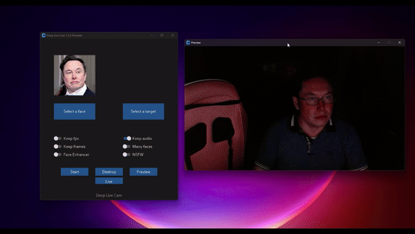
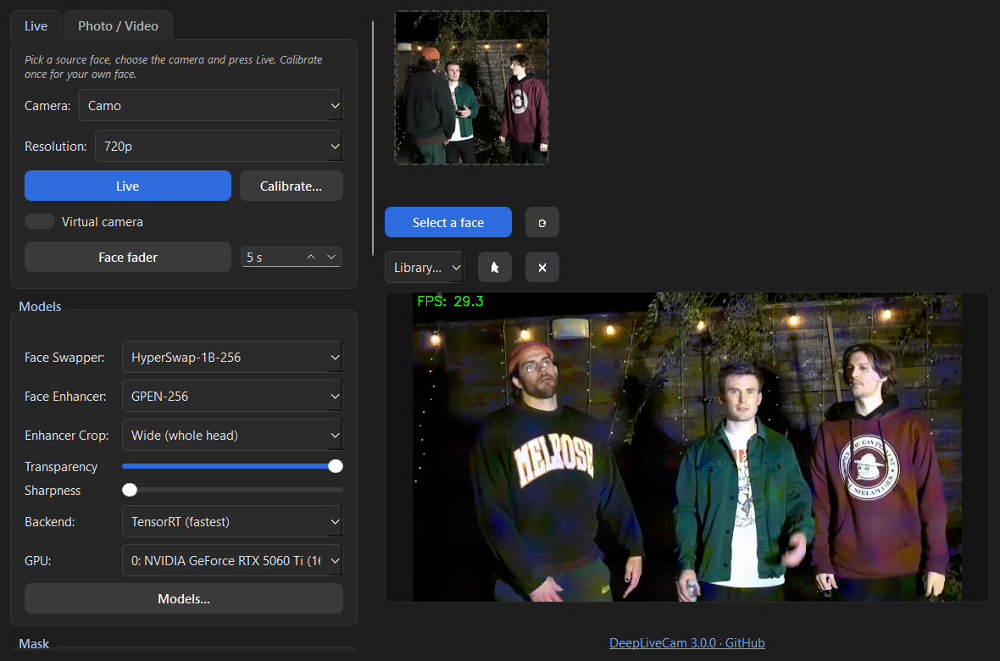
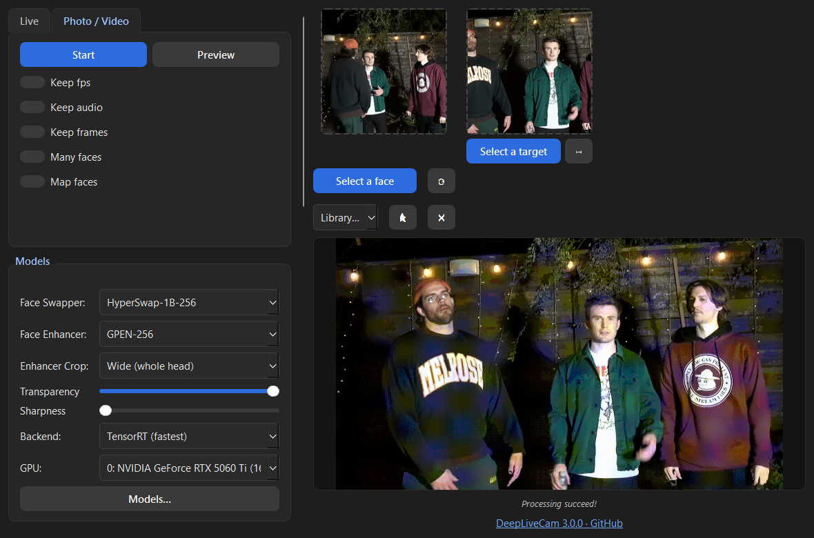
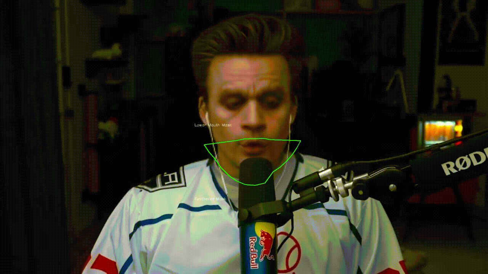
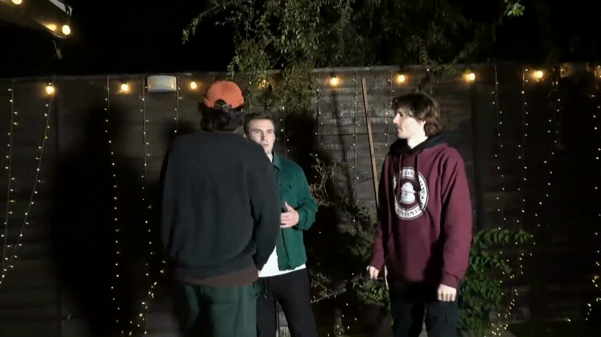

# Deep-Live-Cam — live fork

[](https://www.python.org/downloads/release/python-31210/)
[](https://onnxruntime.ai/)
[](https://doc.qt.io/qtforpython/)
[](LICENSE)
[](https://github.com/beekamai/DeepLiveCam/releases)
[](https://github.com/beekamai/DeepLiveCam/stargazers)

🇬🇧 [English](#english) · 🇷🇺 [Русский](#русский)

<p align="center">
  
</p>

<p align="center">
  
  
</p>

<p align="center">
  
  
</p>

---

## English

A fork of [Deep-Live-Cam](https://github.com/hacksider/Deep-Live-Cam) built around the **live webcam** path: a photo-based face swap that holds its shape through fast motion, fingers and head turns, calibrates itself to your face once, and does not lag behind your head even with a heavy enhancer. The original photo/video mode is still there, on its own tab.

> **Disclaimer.** This software is meant for creative and research use — animating characters, content, performances. Do not use it to impersonate real people without their consent, and check the laws where you live. The models it downloads are for non-commercial research use under their own licences.

### Features

- 🧊 **3D head pose every frame** — 68 landmarks fitted in 3D give the real yaw / pitch / roll: the swap fades past the angles you set with no calibration, and the 3D silhouette keeps the far cheek in the mask on turns (`docs/head-geometry.md`)
- 📺 **Virtual camera** — one switch sends the swapped picture to the OBS Virtual Camera device, so Discord, Zoom or a browser use it as a webcam; **Face fader** eases the swap in or out over a chosen number of seconds
- 🗂️ **Library & face picker** — save named source sets (several photos each) and reload them in a click; a photo with several people opens a picker for the right face
- 🖼️ **Several photos of one person** as the source — front, turned, up, down: their embeddings are blended by the target's pose, so the identity stays steady and turned faces get the photo taken at that angle (`docs/source-identity.md`)
- ⚡ **CUDA-graph inference** for the detector, landmarks, swappers and enhancers; the XSeg occluder rebuilt for the GPU (8× faster than the stock graph)
- 🎯 **Optical-flow tracking** between detections: forty support points over the whole head, forward-backward check, RANSAC — a hand or a mic does not bend the alignment; the face is carried for a second after the detector loses it (deep turn) and fades out instead of cutting
- 🧭 **Calibration** — one minute in front of the camera: your face outline at five poses, an expression-proof crop (pursed or smiling lips no longer shrink the swap), and a fade to your real face *beyond* the turns you chose
- 👁 **Real blinks and eyes** — the swap models only squint; during a blink the eye region comes from the camera, optionally all the time (your own gaze)
- 👄 **Mouth mask** bounded by features (lips → nose base → chin): a moustache is never cut in half
- 🕒 **Low-latency reprojection** — the last finished swap is moved onto the newest camera frame by the tracker, so a slow enhancer delays the expression, not the position
- 🎛 **Instant toggles** — mirror, masks and models re-detect on the next frame instead of dropping the swap for a moment
- 🧩 Swappers: Inswapper-128, HyperSwap 1a / 1b / 1c (256 px). Enhancers: GPEN-256 / 512 / 1024, GFPGAN 1.4, CodeFormer, RestoreFormer++
- 🖥 Responsive PySide6 UI with Live and Photo / Video modes, English and Russian (switchable at runtime)

### Requirements

| | |
|---|---|
| OS | Windows 10 / 11 (tested); macOS Apple Silicon and Linux should work with the stock `requirements.txt` but are untested here |
| GPU | NVIDIA with a **driver ≥ 570** (CUDA 12.8 runtime); 6 GB VRAM is enough for Inswapper + GPEN-256, 8 GB+ for HyperSwap + GFPGAN 1.4. Tested on an RTX 5060 Ti 16 GB |
| Python | **3.12** exactly (the bundled `insightface` wheel is built for it) |
| Disk | ~5 GB: models download on first use into `models/` |
| Camera | any webcam; virtual cameras (Camo, OBS Virtual Camera) work |

No CUDA Toolkit or cuDNN installation is needed — the CUDA libraries come from pip (`nvidia-*` wheels) and are registered at start-up.

### Install on a clean Windows PC

1. **Python 3.12** — download the *Windows installer (64-bit)* from [python.org](https://www.python.org/downloads/release/python-31210/), run it and tick **“Add python.exe to PATH”**. Any 3.12.x is fine.
2. **Git** — [git-scm.com](https://git-scm.com/download/win), default options.
3. **NVIDIA driver** — [nvidia.com/drivers](https://www.nvidia.com/Download/index.aspx), version 570 or newer (check with `nvidia-smi` in a terminal: the *Driver Version* column).
4. **ffmpeg** *(only for saving videos in Photo / Video mode)* — in PowerShell: `winget install Gyan.FFmpeg`, then open a new terminal. Live mode does not need it.
5. **Clone and install** — open *PowerShell* or *cmd*:

   ```bat
   git clone https://github.com/beekamai/DeepLiveCam.git
   cd DeepLiveCam
   install-windows.bat
   ```

   The script creates `venv`, installs the bundled `insightface` wheel and everything from `requirements.txt` (~3 GB with the CUDA libraries). It only needs to run once.
6. **Run** — `run-cuda.bat` (or `venv\Scripts\python run.py --execution-provider cuda`). The first start downloads the face detector (~300 MB); each swapper or enhancer downloads the first time you select it.
7. **TensorRT (recommended)** — `install-windows.bat` offers it automatically when the GPU is supported (GTX 16xx / RTX 20xx and newer); later, run `install-tensorrt.bat` (~3.4 GB from NVIDIA's package index). Once installed the app uses it by itself, and the status line reminds you if it is missing. The models then run 1.5-3× faster (HyperSwap 9.5 → 4.4 ms, Inswapper 19 → 6.2 ms, GPEN-256 8.5 → 4.8 ms) — about 34 fps for the full pipeline against 25 on CUDA. The first use of each model builds its engine — up to a minute, once per model and GPU, cached in `models/trt_cache`. Switch between *TensorRT* and *CUDA graph* on the Models tab; `--no-tensorrt` disables it from the command line.

<details>
<summary>Manual install (any platform)</summary>

```bash
python3.12 -m venv venv
# Windows: venv\Scripts\activate      macOS/Linux: source venv/bin/activate
pip install --upgrade pip
pip install .wheels/insightface-0.7.3-cp312-cp312-win_amd64.whl   # Windows only; elsewhere pip builds insightface from source (needs a C++ compiler)
pip install -r requirements.txt
python run.py --execution-provider cuda        # coreml on Apple Silicon, cpu without a GPU
```
</details>

<details>
<summary>Troubleshooting</summary>

- **`Could not open the camera`** — another app holds it (Camo Studio, a browser tab, Discord). Close it or pick another camera. Calibration and Live cannot run at the same time; opening one closes the other.
- **Low FPS with the GPU busy** — the swap models are hundreds of tiny GPU kernels; the app is launch-bound, not compute-bound. Install TensorRT (step 7) — it fuses each model into one engine; prefer HyperSwap 1b over Inswapper (same cost, 4× the pixels); close other GPU users (browsers with hardware acceleration, Discord overlay).
- **Activity bar under the status line on first Live after installing TensorRT** — engines are being built (the status line says which model); it happens once per model. The window stays responsive: the Live button turns into *Loading… (click to cancel)*, and changing a model during Live reloads it in the background while the last swapped face stays on screen.
- **`No face in the selected source image`** — the source photo must show one clear face; with several photos the ones without a face are skipped and reported.
- **Swap shows the bare face on turns** — recalibrate (Motion → Calibrate…) and turn *as far as the swap should still hold*; the fade begins beyond that.
- **Video output fails** — ffmpeg is not on `PATH`; see step 4.
</details>

### Using it

**Live**: pick a source face (select several photos of the same person at once to blend them by pose; a photo with several people asks which one) → choose the camera and resolution → **Live**. The camera view appears inside the window. Switch on **Virtual camera** to feed Discord, Zoom or a browser directly (needs OBS Studio for its virtual camera driver), or capture the window with OBS. **Face fader** eases the swap in or out over the chosen seconds. The ★ button saves the current photos to the **Library** under a name; the combo next to it reloads a set.

**Calibrate…** (Live tab or Motion → Calibration): press **Start**, hold each pose when asked — straight, then the furthest left / right / up / down at which the swap should *still* hold — and save. Tones mark the countdown, each capture and the end, and *Voice prompts* (English, system voice) say which way to turn, so you need not watch the screen. The profile lives in `calibration/` and is remembered.

**Photo / Video**: pick a source face and a target image or video → **Preview** to check a frame → **Start** to render. Output goes next to the target.

The left column holds the mode (Live | Photo / Video) with its controls, then the settings sections:

| Section | What lives there |
|---|---|
| Live | camera, resolution (360p–1440p), Live, Calibrate…, Virtual camera, Face fader |
| Photo / Video | Start, Preview, keep fps / audio / frames, many faces, map faces |
| Models | swapper, enhancer, enhancer crop, transparency, sharpness, backend (TensorRT / CUDA graph), GPU, **Models…** (what is downloaded, fetch the rest ahead of time) |
| Mask | face outline mask, occlusion mask (XSeg) and its interval, Poisson blend, mask overlay, mouth mask (region or lips-only, the latter keeps a moustache swapped), real blinks, real eyes, forehead and chin reach |
| Motion | face tracking, low-latency reprojection, 3D head pose (angle limits, 3D outline), calibration profiles and their switches |
| Output | webcam colour fix, FPS counter, mirror, **Max FPS** (cap the swap rate to spare the GPU; the preview still shows every camera frame), language, Destroy |

Everything is remembered in `switch_states.json`.

<details>
<summary>Command line</summary>

```
python run.py [-s SOURCE] [-t TARGET] [-o OUTPUT]
              [--execution-provider cuda|coreml|cpu|directml|openvino]
              [--face-swapper-model inswapper_128|hyperswap_1a_256|hyperswap_1b_256|hyperswap_1c_256|alphaface_256]
              [--frame-processor face_swapper [face_enhancer_gpen256 ...]]
              [--enhancer-alignment legacy|model] [--occlusion-mask] [--no-face-tracking]
              [--calibration NAME_OR_PATH] [--mouth-mask] [--many-faces] [--map-faces]
              [--keep-fps] [--keep-audio] [--keep-frames]
              [--video-encoder libx264|libx265|libvpx-vp9] [--video-quality 0-51]
              [--live-mirror] [--lang en|ru] [--max-memory GB] [--execution-threads N] [--no-tensorrt]
```
Passing `-s/--source` runs headless (no window).
</details>

### Docs

- [docs/calibration.md](docs/calibration.md) — profiles, pose proxies, multi-pose references, expression-proof crop, eye and mouth reveal
- [docs/tracking.md](docs/tracking.md) — the tracker, support points, hold through missed detections, instant toggles
- [docs/reprojection.md](docs/reprojection.md) — the display-side tracker and why it never trusts a half-applied correction
- [docs/performance.md](docs/performance.md) — where a frame goes, why the models are launch-bound, what was tried

<details>
<summary>Project layout</summary>

```
run.py                  entry point (registers CUDA DLLs, starts the UI or the CLI)
install-windows.bat     one-shot setup on Windows
install-tensorrt.bat    optional TensorRT runtime (2-3x faster models)
modules/
  ui.py                 PySide6 main window and the live loop
  ui_calibration.py     guided calibration dialog
  calibration.py        profiles, pose proxies, stable keypoints
  face_tracker.py       optical-flow tracker
  reprojection.py       late reprojection onto the newest frame
  face_reveal.py        eye / mouth reveal masks
  face_occluder.py      XSeg occlusion mask
  cuda_graph.py         CUDA graph sessions
  processors/frame/     swappers and enhancers
locales/                UI translations
docs/                   design notes
.wheels/                insightface wheel for Python 3.12 on Windows
```
</details>

### Credits

Built on [Deep-Live-Cam](https://github.com/hacksider/Deep-Live-Cam) by hacksider and contributors, itself based on [roop](https://github.com/s0md3v/roop) by s0md3v. Models and libraries: [insightface](https://github.com/deepinsight/insightface) (detector, landmarks, Inswapper — non-commercial research use), [FaceFusion](https://github.com/facefusion/facefusion) assets (HyperSwap, GPEN, XSeg, CodeFormer, RestoreFormer++), [GFPGAN](https://github.com/TencentARC/GFPGAN), [ONNX Runtime](https://onnxruntime.ai/), [ffmpeg](https://ffmpeg.org/).

### License

AGPL-3.0, as upstream. Models keep their own licences.

---

## Русский

Форк [Deep-Live-Cam](https://github.com/hacksider/Deep-Live-Cam), заточенный под **живую камеру**: подмена лица по одной фотографии, которая держит форму при резких движениях, пальцах и поворотах головы, один раз калибруется под ваше лицо и не отстаёт от головы даже с тяжёлым улучшателем. Исходный режим фото/видео на месте — на своей вкладке.

> **Дисклеймер.** Программа предназначена для творчества и исследований — анимации персонажей, контента, выступлений. Не выдавайте себя за реальных людей без их согласия и сверяйтесь с законами своей страны. Скачиваемые модели — для некоммерческого исследовательского использования по их собственным лицензиям.

### Возможности

- 🧊 **3D-поза головы в каждом кадре** — 68 точек, подогнанных в 3D, дают реальные углы поворота, наклона и крена: подмена гаснет за заданными градусами без калибровки, а 3D-силуэт держит дальнюю щёку в маске на поворотах (`docs/head-geometry.md`)
- 📺 **Виртуальная камера** — один переключатель отдаёт подменённую картинку в устройство OBS Virtual Camera, и Discord, Zoom или браузер берут её как веб-камеру; **Плавная подмена** включает или убирает подмену за заданное число секунд
- 🗂️ **Библиотека и выбор лица** — именованные наборы фото источника сохраняются и загружаются одним кликом; на фото с несколькими людьми открывается выбор нужного лица
- 🖼️ **Несколько фото одного человека** как источник — анфас, в повороте, сверху, снизу: их эмбеддинги смешиваются по позе цели, идентичность держится ровнее, а повёрнутое лицо получает фото под этим углом (`docs/source-identity.md`)
- ⚡ **CUDA-графы** для детектора, точек, свапперов и улучшателей; окклюдер XSeg пересобран под GPU (в 8 раз быстрее исходного графа)
- 🎯 **Трекинг оптическим потоком** между детекциями: сорок опорных точек по всей голове, прямая-обратная проверка, RANSAC — рука или микрофон не искривляют выравнивание; после потери детекции (сильный поворот) лицо ведётся ещё секунду и гаснет, а не обрывается
- 🧭 **Калибровка** — минута перед камерой: контур лица в пяти позах, кроп, устойчивый к мимике (трубочка или улыбка больше не сжимают подмену), и затухание к своему лицу *за* выбранными вами поворотами
- 👁 **Настоящие моргания и глаза** — модели подмены лишь щурятся; при моргании область глаз берётся с камеры, по желанию — всегда (свой взгляд)
- 👄 **Маска рта** по чертам лица (губы → основание носа → подбородок): усы не режутся пополам
- 🕒 **Репроекция с низкой задержкой** — последняя готовая подмена сдвигается трекером на самый свежий кадр камеры: медленный улучшатель задерживает мимику, а не положение
- 🎛 **Мгновенные переключатели** — зеркало, маски и модели передетектируют на следующем кадре, без провала в оригинал
- 🧩 Свапперы: Inswapper-128, HyperSwap 1a / 1b / 1c (256 px). Улучшатели: GPEN-256 / 512 / 1024, GFPGAN 1.4, CodeFormer, RestoreFormer++
- 🖥 Адаптивный интерфейс на PySide6 с режимами Live и Фото / Видео, английский и русский (переключается на лету)

### Требования

| | |
|---|---|
| ОС | Windows 10 / 11 (проверено); macOS Apple Silicon и Linux должны работать со штатным `requirements.txt`, но здесь не проверялись |
| GPU | NVIDIA с **драйвером ≥ 570** (рантайм CUDA 12.8); 6 ГБ VRAM хватает для Inswapper + GPEN-256, 8 ГБ+ для HyperSwap + GFPGAN 1.4. Проверено на RTX 5060 Ti 16 ГБ |
| Python | **ровно 3.12** (под него собран приложенный wheel `insightface`) |
| Диск | ~5 ГБ: модели скачиваются при первом использовании в `models/` |
| Камера | любая веб-камера; виртуальные (Camo, OBS Virtual Camera) работают |

Устанавливать CUDA Toolkit и cuDNN не нужно — библиотеки CUDA приходят из pip (`nvidia-*`) и подключаются при старте.

### Установка на чистый Windows-ПК

1. **Python 3.12** — скачайте *Windows installer (64-bit)* с [python.org](https://www.python.org/downloads/release/python-31210/), запустите и поставьте галочку **«Add python.exe to PATH»**. Подойдёт любой 3.12.x.
2. **Git** — [git-scm.com](https://git-scm.com/download/win), настройки по умолчанию.
3. **Драйвер NVIDIA** — [nvidia.com/drivers](https://www.nvidia.com/Download/index.aspx), версия 570 или новее (проверка: `nvidia-smi` в терминале, столбец *Driver Version*).
4. **ffmpeg** *(только для сохранения видео в режиме Фото / Видео)* — в PowerShell: `winget install Gyan.FFmpeg`, затем откройте новый терминал. Для Live не нужен.
5. **Клонирование и установка** — в *PowerShell* или *cmd*:

   ```bat
   git clone https://github.com/beekamai/DeepLiveCam.git
   cd DeepLiveCam
   install-windows.bat
   ```

   Скрипт создаёт `venv`, ставит приложенный wheel `insightface` и всё из `requirements.txt` (~3 ГБ вместе с библиотеками CUDA). Запускается один раз.
6. **Запуск** — `run-cuda.bat` (или `venv\Scripts\python run.py --execution-provider cuda`). Первый старт скачивает детектор лиц (~300 МБ); каждый сваппер или улучшатель скачивается при первом выборе.
7. **TensorRT (рекомендуется)** — `install-windows.bat` сам предлагает его, если видеокарта поддерживается (GTX 16xx / RTX 20xx и новее); позже — `install-tensorrt.bat` (~3,4 ГБ с индекса пакетов NVIDIA). После установки приложение использует его само, а строка статуса напомнит, если его нет. Модели после этого работают в 1,5–3 раза быстрее (HyperSwap 9,5 → 4,4 мс, Inswapper 19 → 6,2 мс, GPEN-256 8,5 → 4,8 мс) — около 34 fps на полном конвейере против 25 на CUDA. При первом использовании каждой модели собирается её движок — до минуты, один раз на модель и видеокарту, кэш в `models/trt_cache`. Переключение *TensorRT* / *CUDA-граф* — на вкладке Модели; `--no-tensorrt` отключает из командной строки.

<details>
<summary>Ручная установка (любая платформа)</summary>

```bash
python3.12 -m venv venv
# Windows: venv\Scripts\activate      macOS/Linux: source venv/bin/activate
pip install --upgrade pip
pip install .wheels/insightface-0.7.3-cp312-cp312-win_amd64.whl   # только Windows; на других ОС pip соберёт insightface из исходников (нужен компилятор C++)
pip install -r requirements.txt
python run.py --execution-provider cuda        # coreml на Apple Silicon, cpu без GPU
```
</details>

<details>
<summary>Если что-то не так</summary>

- **`Could not open the camera`** — камеру держит другое приложение (Camo Studio, вкладка браузера, Discord). Закройте его или выберите другую камеру. Калибровка и Live не работают одновременно: открытие одного закрывает другое.
- **Низкий FPS при занятом GPU** — модели подмены состоят из сотен крошечных GPU-ядер, приложение упирается в их запуск, а не в вычисления. Поставьте TensorRT (шаг 7) — он сплавляет каждую модель в один движок; берите HyperSwap 1b вместо Inswapper (та же цена, в 4 раза больше пикселей); закрывайте других потребителей GPU (браузеры с аппаратным ускорением, оверлей Discord).
- **Полоска активности под строкой статуса при первом Live после установки TensorRT** — собираются движки (в строке статуса видно, какая модель); это один раз на модель. Окно остаётся живым: кнопка Live превращается в *Загрузка… (нажмите, чтобы отменить)*, а смена модели во время Live перегружает её в фоне, пока на экране держится последнее подменённое лицо.
- **`No face in the selected source image`** — на исходном фото должно быть одно чёткое лицо; при нескольких фото те, где лица нет, пропускаются с сообщением.
- **На поворотах видно своё лицо** — перекалибруйтесь (Движение → Калибровка…) и поворачивайтесь *до предела, где подмена ещё должна держаться*; затухание начинается за ним.
- **Не сохраняется видео** — ffmpeg нет в `PATH`; см. шаг 4.
</details>

### Как пользоваться

**Live**: выберите исходное лицо (можно сразу несколько фото одного человека, они смешаются по позе; на фото с несколькими людьми программа спросит, кого брать) → камеру и разрешение → **Live**. Картинка с камеры появляется внутри окна. Включите **Виртуальную камеру**, чтобы отдавать её напрямую в Discord, Zoom или браузер (нужен OBS Studio ради его драйвера виртуальной камеры), или захватывайте окно в OBS. **Плавная подмена** включает или убирает подмену за заданные секунды. Кнопка ★ сохраняет текущие фото в **Библиотеку** под именем; комбо рядом загружает набор.

**Калибровка…** (вкладка Live или Движение → Калибровка): нажмите **Старт**, держите каждую позу по запросу — прямо, затем максимально влево / вправо / вверх / вниз, где подмена ещё *должна* держаться, — и сохраните. Отсчёт, каждый захват и финал отмечаются сигналами, а *Голосовые подсказки* (английский, системный голос) говорят, куда поворачивать, — на экран смотреть не обязательно. Профиль лежит в `calibration/` и запоминается.

**Фото / Видео**: исходное лицо и целевое изображение или видео → **Предпросмотр** для проверки кадра → **Старт** для рендера. Результат кладётся рядом с целью.

В левой колонке — режим (Live | Фото / Видео) с его кнопками, ниже секции настроек:

| Секция | Что там |
|---|---|
| Live | камера, разрешение (360p–1440p), Live, Калибровка…, виртуальная камера, плавная подмена |
| Фото / Видео | Старт, Предпросмотр, сохранить fps / звук / кадры, много лиц, сопоставление лиц |
| Модели | сваппер, улучшатель, кроп улучшателя, прозрачность, резкость, бэкенд (TensorRT / CUDA-граф), GPU, **Модели…** (что скачано, докачать остальное заранее) |
| Маска | маска по контуру, маска перекрытий (XSeg) и её интервал, Poisson-смешивание, показ маски, маска рта (область или только губы — второй режим не раскрывает усы), настоящие моргания, свои глаза, запас на лоб и подбородок |
| Движение | трекинг лица, репроекция, 3D-поза головы (пороги углов, 3D-контур), профили калибровки и их переключатели |
| Вывод | цветокоррекция веб-камеры, счётчик FPS, зеркало, **Макс. FPS** (потолок частоты подмены, чтобы разгрузить GPU; превью по-прежнему показывает каждый кадр камеры), язык, Закрыть |

Всё запоминается в `switch_states.json`.

<details>
<summary>Командная строка</summary>

```
python run.py [-s SOURCE] [-t TARGET] [-o OUTPUT]
              [--execution-provider cuda|coreml|cpu|directml|openvino]
              [--face-swapper-model inswapper_128|hyperswap_1a_256|hyperswap_1b_256|hyperswap_1c_256|alphaface_256]
              [--frame-processor face_swapper [face_enhancer_gpen256 ...]]
              [--enhancer-alignment legacy|model] [--occlusion-mask] [--no-face-tracking]
              [--calibration NAME_OR_PATH] [--mouth-mask] [--many-faces] [--map-faces]
              [--keep-fps] [--keep-audio] [--keep-frames]
              [--video-encoder libx264|libx265|libvpx-vp9] [--video-quality 0-51]
              [--live-mirror] [--lang en|ru] [--max-memory GB] [--execution-threads N] [--no-tensorrt]
```
С `-s/--source` программа работает без окна.
</details>

### Документация

- [docs/calibration.md](docs/calibration.md) — профили, прокси позы, многопозные опоры, кроп под мимику, глаза и рот
- [docs/tracking.md](docs/tracking.md) — трекер, опорные точки, удержание при потере детекции, мгновенные переключатели
- [docs/reprojection.md](docs/reprojection.md) — дисплейный трекер и почему он не верит полуприменённой поправке
- [docs/performance.md](docs/performance.md) — куда уходит кадр, почему модели упираются в запуск ядер, что пробовали

<details>
<summary>Структура проекта</summary>

```
run.py                  точка входа (подключает DLL CUDA, запускает окно или CLI)
install-windows.bat     установка на Windows одним запуском
install-tensorrt.bat    опциональный рантайм TensorRT (модели в 2–3 раза быстрее)
modules/
  ui.py                 главное окно PySide6 и живой цикл
  ui_calibration.py     пошаговая калибровка
  calibration.py        профили, прокси позы, стабильные точки
  face_tracker.py       трекер оптическим потоком
  reprojection.py       репроекция на свежий кадр
  face_reveal.py        маски глаз / рта
  face_occluder.py      маска перекрытий XSeg
  cuda_graph.py         сессии с CUDA-графами
  processors/frame/     свапперы и улучшатели
locales/                переводы интерфейса
docs/                   заметки по устройству
.wheels/                wheel insightface для Python 3.12 на Windows
```
</details>

### Благодарности

Основано на [Deep-Live-Cam](https://github.com/hacksider/Deep-Live-Cam) от hacksider и участников, который в свою очередь вырос из [roop](https://github.com/s0md3v/roop) от s0md3v. Модели и библиотеки: [insightface](https://github.com/deepinsight/insightface) (детектор, точки, Inswapper — только некоммерческие исследования), ассеты [FaceFusion](https://github.com/facefusion/facefusion) (HyperSwap, GPEN, XSeg, CodeFormer, RestoreFormer++), [GFPGAN](https://github.com/TencentARC/GFPGAN), [ONNX Runtime](https://onnxruntime.ai/), [ffmpeg](https://ffmpeg.org/).

### Лицензия

AGPL-3.0, как у исходного проекта. Модели — под своими лицензиями.

---

### ⭐ Star history

[](https://star-history.com/#beekamai/DeepLiveCam&Date)
